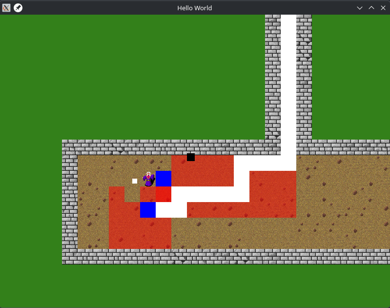

# RPG-Go

A demo of a 2D tile-based RPG framework written in Go using OpenGL 4.3 and GLFW. Not intended for production use.

<!-- TODO: Add gameplay GIF -->


## Overview

RPG-Go is a 2D game engine built for tile-based role-playing games. It renders sprites from a texture atlas via a framebuffer-based render pipeline, features step-based (roguelike) movement, interactive tiles (doors), camera with deadzone following, A* pathfinding with animated BFS/A* traversal visualization, and generic data structures for extensibility.

<!-- TODO: Add screenshot -->


## Features

- **Tile-based rendering** from a texture atlas with shader-driven sub-region sampling
- **Framebuffer (FBO) render pipeline** — offscreen rendering to a texture, then blit to screen, ready for post-processing
- **Step-based (roguelike) movement** — one tile per key press
- **Interactive tiles** — doors that open and close
- **Camera with deadzone** — scrolls smoothly when the player strays from center
- **A\* pathfinding** with animated BFS and A\* traversal visualizations
- **Generic data structures** — priority queue and pathfinding implemented with Go generics
- **Configurable shaders** — default textured quad shader + screen pass shader

## Prerequisites

- Go 1.21 or later
- CGo (enabled by default)
- OpenGL 4.3 compatible GPU and drivers

## Installation

```bash
# Clone the repository
git clone https://github.com/ARF-DEV/rpg-go.git
cd rpg-go

# Download dependencies and tidy module files
go mod tidy

# Build
go build

# Run
./rpg-go
```

## Controls

| Key | Action |
|-----|--------|
| W/A/S/D | Move player (one tile per press) |
| E | Interact with tile in front of player (open/close doors) |
| Space | Trigger A* pathfinding visualization |
| ESC | Quit |

## Project Structure

```
rpg-go/
├── engine/            # Low-level OpenGL abstractions
│   ├── core.go        # Drawable / Renderer interfaces
│   ├── sprite_renderer.go  # FBO-based renderer
│   ├── shader.go      # Shader compilation and uniforms
│   ├── texture.go     # Texture loading and OpenGL handles
│   ├── input.go       # Key input callbacks and state
│   ├── tile.go        # Tile types and texture index
│   ├── timer.go       # Delta time tracking
│   └── camera.go      # Camera stub (WIP)
├── game/              # High-level game logic
│   ├── game.go        # Main game state, camera, update/draw loop
│   ├── player.go      # Player entity with movement and rendering
│   ├── level.go       # Level loading and tile rendering
│   ├── structure.go   # Traversal viz, pathfinding, generic queue
│   ├── prioqueue.go   # Generic binary-heap priority queue
│   └── helper.go      # Neighbor lookup utility
├── assets/            # Shaders, texture atlas, maps
│   ├── atlas/         # Texture atlas image + index
│   ├── maps/          # .map level files
│   ├── vertex.glsl / fragment.glsl         # Default shaders
│   └── screen_vertex.glsl / screen_fragment.glsl  # Screen pass shaders
└── main.go            # Entry point, GLFW/GL init, game loop
```

## Dependencies

- [github.com/go-gl/gl](https://github.com/go-gl/gl) — OpenGL 4.3 bindings
- [github.com/go-gl/glfw/v3.3/glfw](https://github.com/go-gl/glfw) — GLFW 3.3 windowing and input
- [github.com/go-gl/mathgl](https://github.com/go-gl/mathgl) — Math types (`mgl32.Vec2`, `Mat4`, etc.)
- [golang.org/x/image](https://golang.org/x/image) — Image decoding (PNG/JPEG)

## License

MIT
